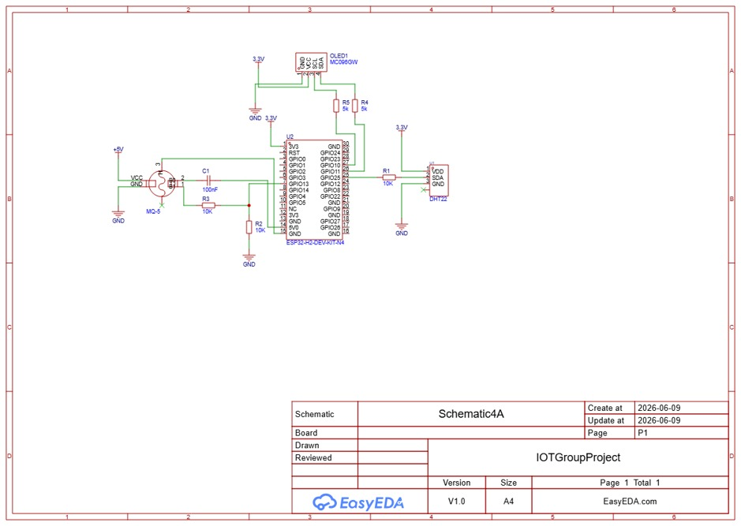
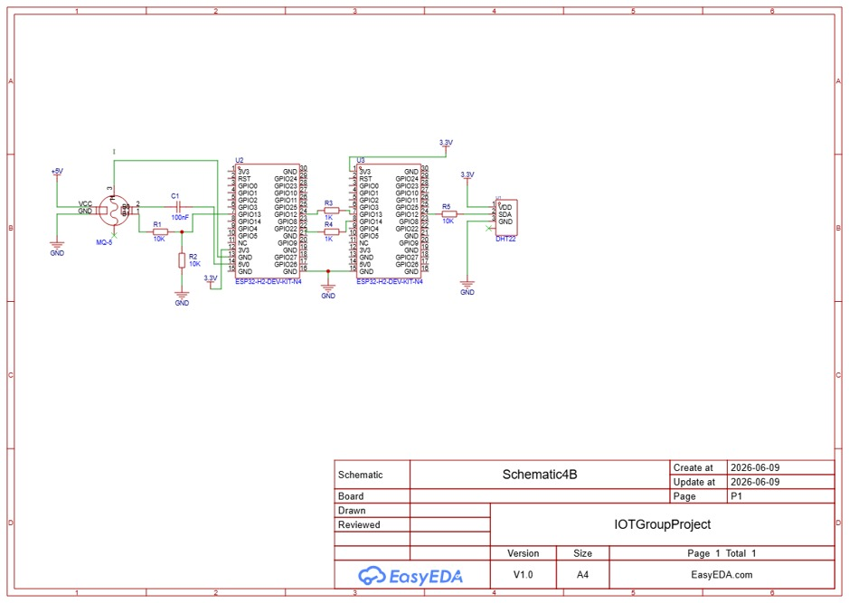
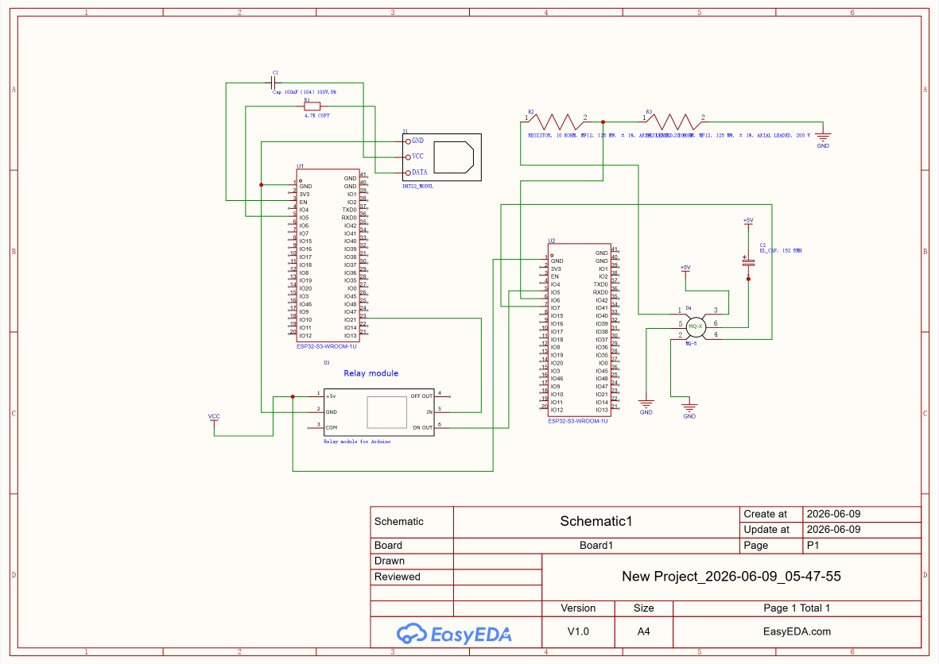

 
 

# Motion Masters Project ICS 4A

**Strathmore University**

Bachelor Of Science in Informatics and Computer Science (BICS)

Embedded Systems and Internet of Things (IOT)

ICS 4A

Deliverable 1

Group: Motion Masters

 

---

## Table of Contents

- [Question 1](#question-1)
- [Question 2](#question-2)
- [Components](#components)
- [Question 3](#question-3-component-documentation-and-links)
- [Question 4](#question-4)

---

## Question 1:

The carnation (*Dianthus caryophyllus*), commonly known as the "clove pink," is a perennial flower native to the Mediterranean region. It grows 30-80 cm tall with narrow blue-green leaves and flowers available in colours including red, white, pink, yellow, and purple. It is widely grown as a cut flower valued for its long vase life.

  

<em>Figure 1: Carnation flower (Dianthus caryophyllus).</em>

### Optimal Growing Conditions

| Parameter | Optimal Range |
|---|---|
| Temperature | Daytime: 18-24°C Night: 10-15°C |
| Relative Humidity | 50-70% |
| Soil Type | Sandy loam, rich in organic matter |
| Soil Moisture Content | 40-60% of field capacity |
| Soil pH | 6.0-7.0 |
| Sunlight Exposure | 6-8 hours/day |

### Parameter Explanations

#### Temperature: 18-24°C (day), 10-15°C (night)

Carnations are cool-weather plants. Daytime temperatures of 18-24°C support efficient photosynthesis and stem development, while cooler nights of 10-15°C promote bud formation. Temperatures above 30°C cause heat stress, resulting in thin stems.

#### Relative Humidity: 50-70%

This range provides adequate atmospheric moisture for healthy growth without creating conditions that favour fungal diseases such as Botrytis and rust. Below 40%, the air becomes too dry, stressing the plant, while above 70% promotes mould and disease in enclosed greenhouse environments.

#### Soil Type: Sandy Loam

Carnation roots are highly susceptible to rot. Sandy loam provides the balance of free drainage and adequate moisture retention that prevents waterlogging while keeping roots supplied with nutrients.

#### Soil Moisture: 40-60% of Field Capacity

Carnations need consistent moisture for nutrient uptake and flower development, but waterlogged soil suffocates roots and encourages disease. Staying within 40-60% of field capacity keeps the soil damp enough to sustain growth without crossing into harmful saturation.

#### Soil pH: 6.0-7.0

This slightly acidic to neutral range ensures key nutrients, particularly phosphorus, calcium, and iron, remain soluble and available to the plant. A pH below 6.0 locks out nutrients, while above 7.0 causes micronutrient deficiencies that result in yellowing leaves and stunted growth.

#### Sunlight Exposure: 6-8 Hours per Day

Adequate sunlight drives photosynthesis and supports stem strength. Insufficient light produces weak stems and fewer flowers.

---

## Question 2: 

### Components

1. DHT22 (AM2302)
2. Arduino Uno Microcontroller
3. Soil Moisture Sensor
4. Soil pH Meter Kit
5. BH1750 Light Sensor (I2C)
6. MQ-2 Gas Sensor
7. 10kΩ resistor
8. 16x2 LCD display
9. Breadboard
10. Capacitors
11. Jumper wires
12. Micro USB cable

---

## Question 3: Component Documentation and Links

### 1. 1.3" White IIC 128x64 OLED LCD

| Parameter | Value |
|---|---|
| Driver IC | SH1106 |
| Resolution | 128 x 64 pixels |
| Interface | I2C (IIC) / SPI |
| Supply Voltage | 3.3 V - 5 V DC |
| Operating Temperature | -20 degC to 70 degC |
| Display Colour | White |

Documentation links:

1. [General OLED Datasheet (PDF) - Adafruit](https://cdn-shop.adafruit.com/datasheets/SSD1306.pdf)
2. [SH1106 Driver IC Datasheet (PDF) - Waveshare](https://www.waveshare.com/w/upload/e/e3/1.3inch-SH1106-OLED.pdf)
3. [SH1106 Driver IC Datasheet (PDF) - SparkFun](https://cdn.sparkfun.com/assets/2/6/8/9/7/1.3inch-SH1106-OLED_Datasheet.pdf)
4. [SH1106 Full Chip Datasheet (PDF) - Pololu](https://www.pololu.com/file/0J1813/SH1106.pdf)
5. [Module Product Page and User Manual - LCD Wiki](https://www.lcdwiki.com/1.3inch_SPI_OLED_Module_SH1106_SKU:MSP130X)

### 2. ESP32S Devkit Wi-Fi + BLE Module (30 Pin)

| Parameter | Value |
|---|---|
| CPU | Dual-core Xtensa LX6, up to 240 MHz |
| Flash | 4 MB |
| Wi-Fi | 802.11 b/g/n (2.4 GHz) |
| Bluetooth | v4.2 BR/EDR + BLE |
| GPIO Pins | 30 (usable) |
| Supply Voltage | 3.3 V (logic) / 5 V via USB or VIN |

Documentation links:

1. [ESP32 Datasheet (PDF)](https://www.es.co.th/Schemetic/PDF/ESP32.PDF)
2. [ESP32 SoC Datasheet (PDF) - Espressif Official](https://www.espressif.com/sites/default/files/documentation/esp32_datasheet_en.pdf)
3. [ESP32-DevKitC Hardware Reference and User Guide - Espressif Docs](https://docs.espressif.com/projects/esp-dev-kits/en/latest/esp32/esp32-devkitc/index.html)
4. [ESP32-WROOM-32 Module Datasheet (PDF) - Mouser](https://www.mouser.com/datasheet/2/891/esp-wroom-32_datasheet_en-1223836.pdf)
5. [ESP32 Devkit Pinout Diagram and Reference - Circuitstate](https://www.circuitstate.com/pinouts/doit-esp32-devkit-v1-wifi-development-board-pinout-diagram-and-reference/)

### 3. DHT22 (AM2302) Temperature and Humidity Sensor

| Parameter | Value |
|---|---|
| Humidity Range | 0 - 100 % RH |
| Humidity Accuracy | +/- 2 % RH |
| Temperature Range | -40 degC to 80 degC |
| Temperature Accuracy | +/- 0.5 degC |
| Resolution | 0.1 degC / 0.1 % RH |
| Supply Voltage | 3.3 V - 5.5 V DC |

Documentation links:

1. [DHT22 Datasheet (PDF)](https://ardustore.dk/error/DHT22%20Datasheet.pdf)
2. [AM2302 (DHT22) Official Datasheet (PDF) - Adafruit](https://cdn-shop.adafruit.com/datasheets/Digital+humidity+and+temperature+sensor+AM2302.pdf)
3. [DHT22 Datasheet (PDF) - SparkFun](https://cdn.sparkfun.com/assets/f/7/d/9/c/DHT22.pdf)
4. [AM2302 / DHT22 Overview and Specifications - EDN](https://www.edn.com/am2302-dht22-datasheet/)

### 4. MQ-5 LPG, Natural Gas, and Coal Gas Sensor

| Parameter | Value |
|---|---|
| Target Gases | LPG, natural gas, methane, propane, butane, coal gas |
| Operating Voltage | 2.5 V - 5.0 V DC |
| Heater Voltage | 5 V +/- 0.1 V |
| Heater Resistance | 31 ohm +/- 10% |
| Heating Consumption | < 800 mW |
| Operating Temperature | -10 degC to 50 degC |

Documentation links:

1. [MQ-5 Official Datasheet (PDF) - Winsen Electronics](https://www.winsen-sensor.com/d/files/MQ-5.pdf)
2. [MQ-5 Technical Data Sheet (PDF) - Seeed Studio](https://files.seeedstudio.com/wiki/Grove-Gas_Sensor-MQ5/res/MQ-5.pdf)
3. [MQ-5 Sensor Overview and Module User Manual (PDF) - DigiKey / DFRobot](https://media.digikey.com/pdf/Data%20Sheets/DFRobot%20PDFs/SEN0130_Web.pdf)
4. [Waveshare MQ-5 Module Product Wiki](https://www.waveshare.com/wiki/MQ-5_Gas_Sensor)

### 5. 5V 1-Channel Low-Level Trigger Relay Module

| Parameter | Value |
|---|---|
| Control Voltage | 5 V DC (VCC) |
| Trigger Level (Low) | 0 V - 1.5 V (active LOW activates relay) |
| Driver Current Required | 15 - 20 mA |
| Quiescent Current | ~4 mA |
| Max AC Load | 250 V AC / 10 A |
| Max DC Load | 30 V DC / 10 A |

Documentation links:

1. [1-Channel Relay Module User Guide and Datasheet (PDF) - HandsOnTec](https://handsontec.com/dataspecs/relay/1Ch-relay.pdf)
2. [5V Low-Level Trigger 1-Channel Relay Module Datasheet (PDF) - Scribd](https://www.scribd.com/document/427360534/5V-low-level-trigger-One-1-Channel-Relay-pdf)
3. [5V 1-Channel Relay Module Product Page (HW-307B) - ThinkRobotics](https://thinkrobotics.com/products/1-channel-relay-module-shield-5v)

---

## Question 4

### a) One ESP32S connected to one MQ-5, one DHT22, and one LCD

  

<em>Figure 3: Question 4(a) system setup.</em>

### b) One ESP32S connected to one MQ-5, interfaced directly with another ESP32S connected to one DHT22

<!-- Image Placeholder: Question 4(b) diagram (images/question4-b-setup.png) -->

  

<em>Figure 4: Question 4(b) system setup.</em>

### c) One ESP32S connected to one DHT22 and one relay, connected to another ESP32S connected to one MQ-5

  

<em>Figure 5: Question 4(c) system setup.</em>

---

---

