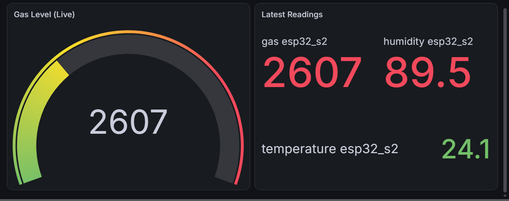

<div align="center">


# Motion Masters Project ICS 4A

**Strathmore University**

Bachelor of Science in Informatics and Computer Science (BICS)

Embedded Systems and Internet of Things (IoT)

ICS 4A

Deliverable 3

Group: Motion Masters


</div>

---

## Table of Contents

- [Overview](#overview)
- [System Architecture](#system-architecture)
- [How We Did It Online (VS Code + Wokwi + PlatformIO)](#how-we-did-it-online-vs-code--wokwi--platformio)
- [How We Did It As a Group (Lab Setup)](#how-we-did-it-as-a-group-lab-setup)
- [Cloud Storage and Visualisation](#cloud-storage-and-visualisation)
- [Known Limitations](#known-limitations)

---

## Overview

Deliverable 3 extends the Motion Masters sensor rig by integrating cloud storage and live data visualisation. Sensor readings from the DHT22 and MQ-5 sensors are collected by an ESP32-S2, temporarily stored in a batch buffer, uploaded to InfluxDB Cloud, and visualised using Grafana.

---

## System Architecture

```text
Sensors (DHT22 + MQ-5)
          │
          ▼
      ESP32-S2 Firmware
          │
          ▼
      Batch Buffer
          │
          ▼
    InfluxDB Cloud
          │
          ▼
 Grafana Dashboard

          │
          ▼
     OLED Display
```

The system components are:

- **DHT22** – Measures temperature and humidity.
- **MQ-5** – Measures gas concentration.
- **ESP32-S2** – Reads sensors every two seconds, displays live values on the OLED, and uploads batches of readings.
- **InfluxDB Cloud** – Stores timestamped sensor readings in a time-series database.
- **Grafana** – Retrieves the stored data and presents it through live dashboards.

---

## How We Did It Online (VS Code + Wokwi + PlatformIO)

The project was first developed and tested in simulation before being deployed on physical hardware.

We used:

- **Visual Studio Code**
- **PlatformIO**
- **Wokwi for VS Code**

PlatformIO was used to build the firmware while Wokwi simulated the ESP32-S2, DHT22, MQ-5, and OLED display. Wokwi's internet access through the `Wokwi-GUEST` network allowed the simulated ESP32 to communicate directly with InfluxDB Cloud over HTTPS.

### Steps Followed

1. Created the circuit in `diagram.json`.
2. Developed `src/main.cpp` to:
   - Read the DHT22 and MQ-5 every two seconds.
   - Display readings on the OLED.
   - Batch readings and upload them to InfluxDB Cloud every ten seconds.
3. Created an InfluxDB Cloud bucket and generated an API token.
4. Connected Grafana to InfluxDB Cloud.
5. Designed a dashboard containing three visualisations.
6. Verified that data appeared correctly in both InfluxDB and Grafana.

---

### Wokwi Simulation

<p align="center">

</p>

<p align="center">
<em>Figure 1: Wokwi simulation showing the ESP32-S2, sensors, OLED display, and successful InfluxDB uploads.</em>
</p>

---

## How We Did It As a Group (Lab Setup)

The simulated project was then recreated using the physical ESP32-S2 development board.

The same firmware (`main.cpp`) was uploaded to the ESP32-S2 using the Arduino IDE. The simulation WiFi credentials were replaced with our local WiFi credentials while keeping the same InfluxDB Cloud bucket, organisation, and API token.

The DHT22, MQ-5, and OLED display were connected using the same wiring used in the simulation. Live sensor readings appeared on the OLED display and were simultaneously uploaded to InfluxDB Cloud, where they became immediately available on the Grafana dashboard.

---

### Team Working in the Lab

<p align="center">

</p>

<p align="center">
<em>Figure 2: Team assembling and testing the physical implementation.</em>
</p>

---

### Physical Hardware Setup

<p align="center">

</p>

<p align="center">
<em>Figure 3: ESP32-S2 connected to the DHT22, MQ-5, and OLED display.</em>
</p>

---

## Cloud Storage and Visualisation

### InfluxDB Cloud

<p align="center">

</p>

<p align="center">
<em>Figure 4: Sensor readings stored in InfluxDB Cloud.</em>
</p>

---

### Grafana Dashboard

<p align="center">

</p>

<p align="center">
<em>Figure 5: Grafana dashboard showing the time-series visualisation.</em>
</p>

---

<p align="center">

</p>

<p align="center">
<em>Figure 6: Grafana dashboard showing the gauge and stat panels.</em>
</p>

---

The dashboard includes three visualisations:

1. **Time Series** – Temperature and humidity trends over time.
2. **Gauge** – Live gas concentration with colour thresholds.
3. **Stat Panel** – Latest temperature, humidity, and gas readings.

---

## Known Limitations

- TLS certificate verification is disabled (`client.setInsecure()`) to simplify HTTPS communication during testing.
- The firmware currently uses a fixed InfluxDB bucket name (`sensor_data`).
- Internet connectivity is required for uploading sensor data.
- Additional implementation details are available in `src/main.cpp` and the project documentation.

---