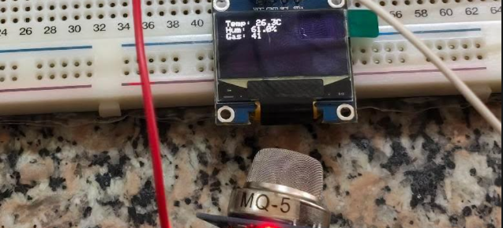
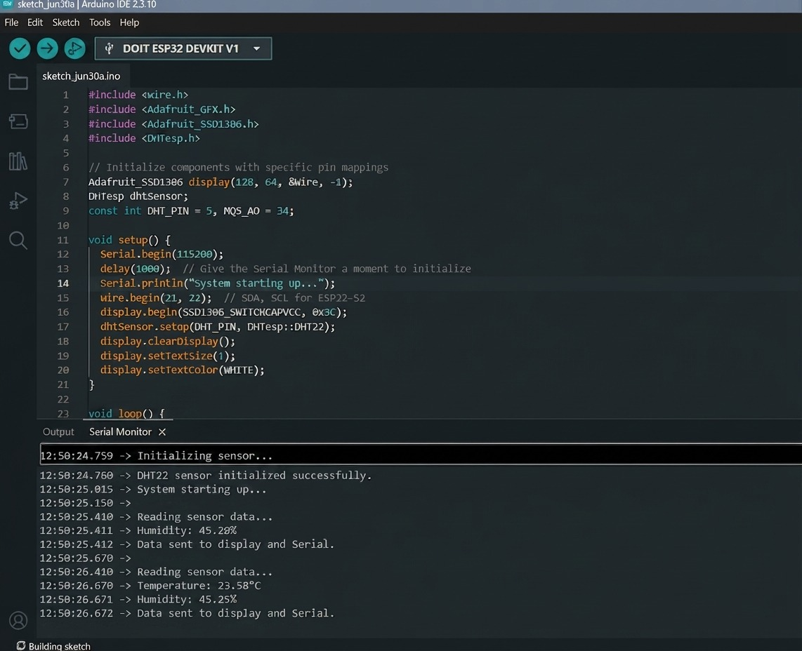
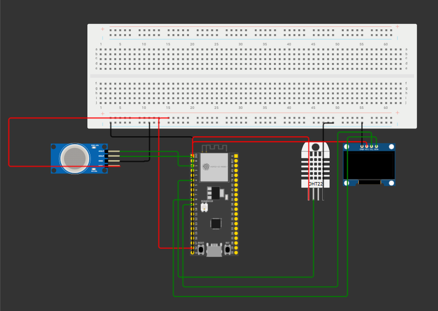
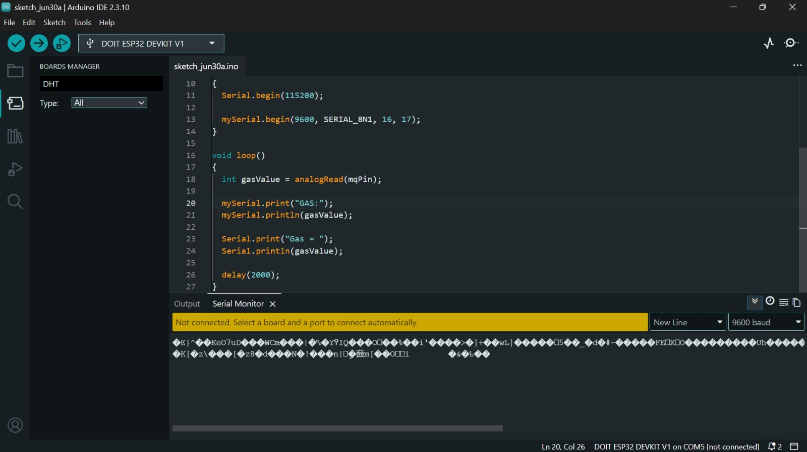
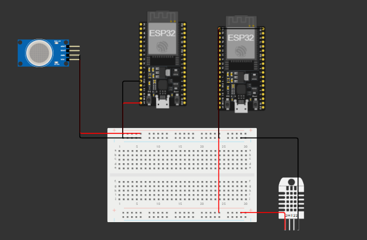
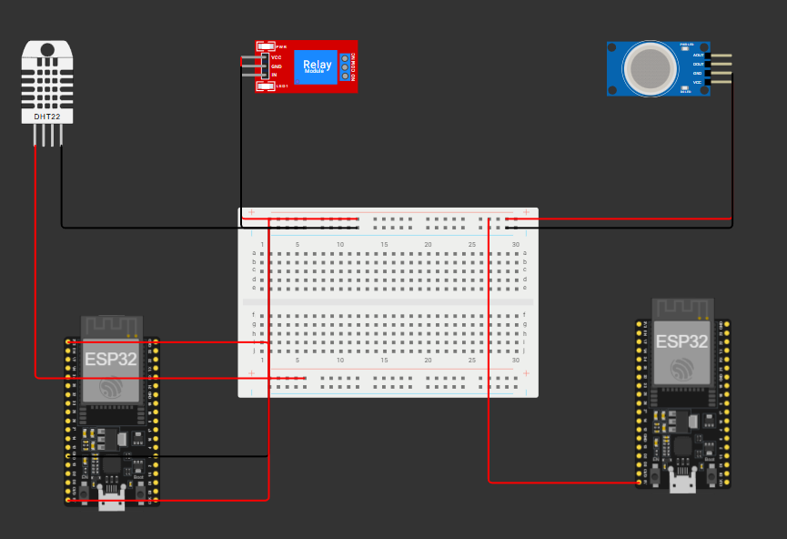

# Motion Masters Project ICS 4A

**Strathmore University**

Bachelor Of Science in Informatics and Computer Science (BICS)

Embedded Systems and Internet of Things (IOT)

ICS 4A

Deliverable 2

Group: Motion Masters

---

## Table of Contents

- [Question 1a](#question-1a)
- [Question 1b](#question-1b)
- [Question 1c](#question-1c)
- [Challenges Faced](#challenges-faced-across-simulations-b--c)

---

## Question 1a

### The following section presents the physical & simulation implementation of 1a:

### Physical Implementation

  

<em>Figure 1: Physical Implementation (1 ESP32S connected to 1 MQ-5, 1 DHT22 and 1 LCD).</em>

---

### LCD Output

  

<em>Figure 2: LCD Output.</em>

---

### IDE Output

  

<em>Figure 3: IDE Output.</em>

---

### Wokwi Simulation

  

<em>Figure 4: Wokwi Simulation.</em>

### Link to the Wokwi Simulation

<a href="https://wokwi.com/projects/467656007930712065">Simulation 1A</a>

---

## Question 1b

### The following section presents the physical & simulation implementation of 1b:

### Physical Implementation

  

<em>Figure 5: Physical Implementation ( 1 ESP32S connected to 1 MQ-5 interfaced directly with another ESP32S connected 
to 1 DHT22).</em>

---

### IDE Output

  

<em>Figure 6: IDE Output.</em>

---

### Wokwi Simulation

  

<em>Figure 7: Wokwi Simulation.</em>

### Link to the Wokwi Simulation

<a href="https://wokwi.com/projects/467884444458313729">Simulation 1B</a>

---

## Question 1c

### The following section presents the simulation implementation of 1c:

### Wokwi Simulation Implementation

  

<em>Figure 8: Wokwi Simulation.</em>

---

### Link to the Wokwi Simulation

<a href="https://wokwi.com/projects/468337027127865345">Simulation 1C</a>

---

## Challenges Faced Across Simulations (B & C)

### Wokwi's simulator is designed for one microcontroller at a time.

Two simulations 
required two ESP32 boards communicating with each other, but Wokwi's environment is 
built around single-board projects. Getting two boards to coexist in one simulation 
required a workaround where both boards were configured within the same project files 
and programmed to figure out their own roles automatically at startup, rather than being 
set up as two completely separate simulations.

---

### Wiring errors that caused silent failures.

Across both simulations, certain wiring 
mistakes in the circuit configuration files produced no error messages and no output, 
making them difficult to diagnose. These included connections referencing pins that did 
not exist on the boards and duplicate wires connecting the same points twice. Each issue 
was found through careful manual review of the circuit layout and corrected, after which 
the simulations ran as expected.

---