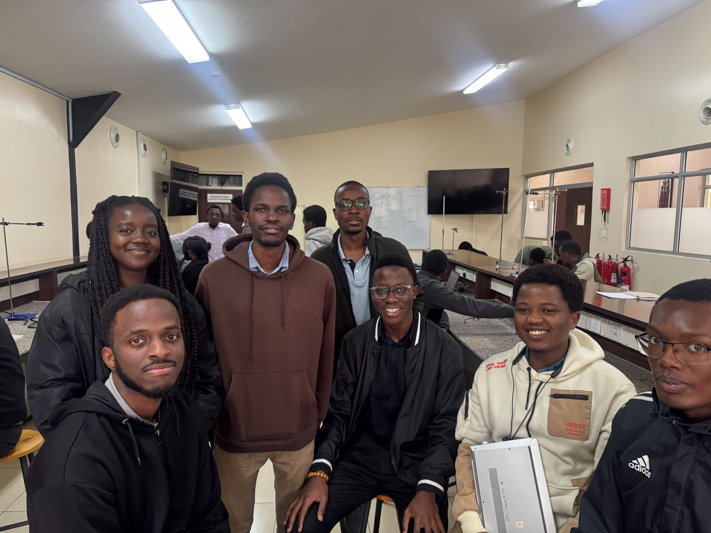

 
 

# Motion Masters Project ICS 4A

**Strathmore University**

Bachelor Of Science in Informatics and Computer Science (BICS)

Embedded Systems and Internet of Things (IOT)

ICS 4A

Deliverable 2

Group: Motion Masters

 

---

## Table of Contents

- [Question 1](#question-1)

---

## Question 1a:

### The following section presents the physical & simulation implementation of 1a:

  

<em>Figure 1: Physical Implementation (1 ESP32S connected to 1 MQ-5, 1 DHT22 and 1 LCD.).</em>

### Link to the Wokwi Simulation

[Simulation 1A](https://wokwi.com/projects/467656007930712065)

---

---

