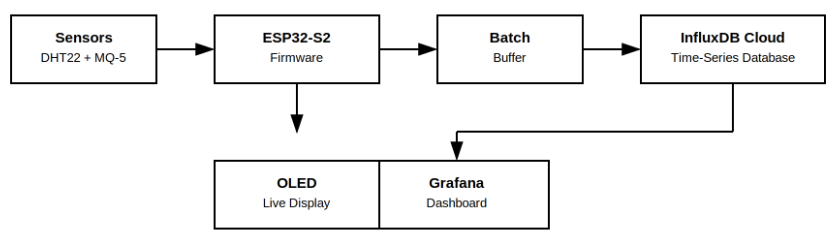
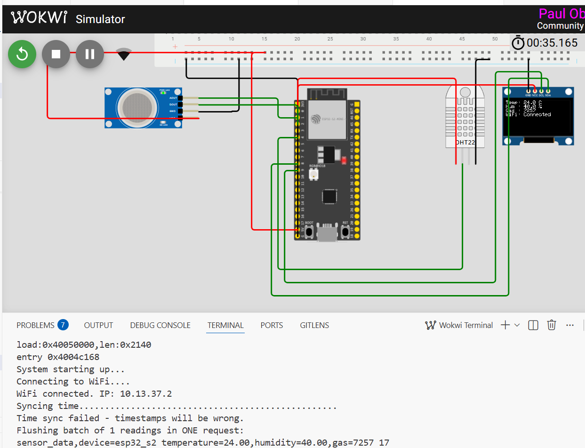
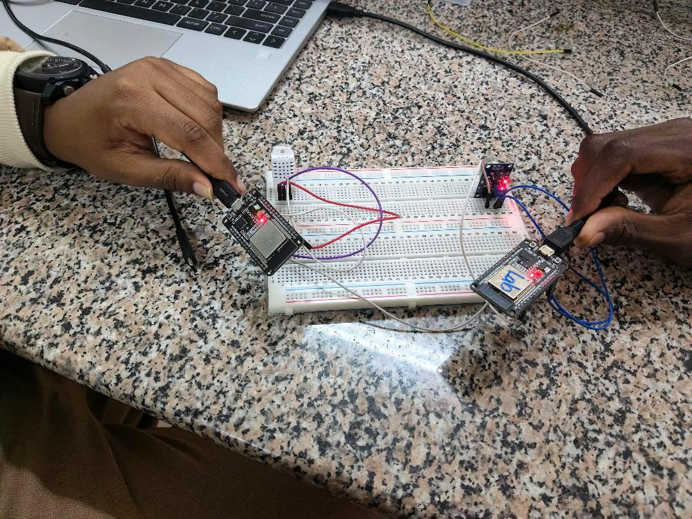
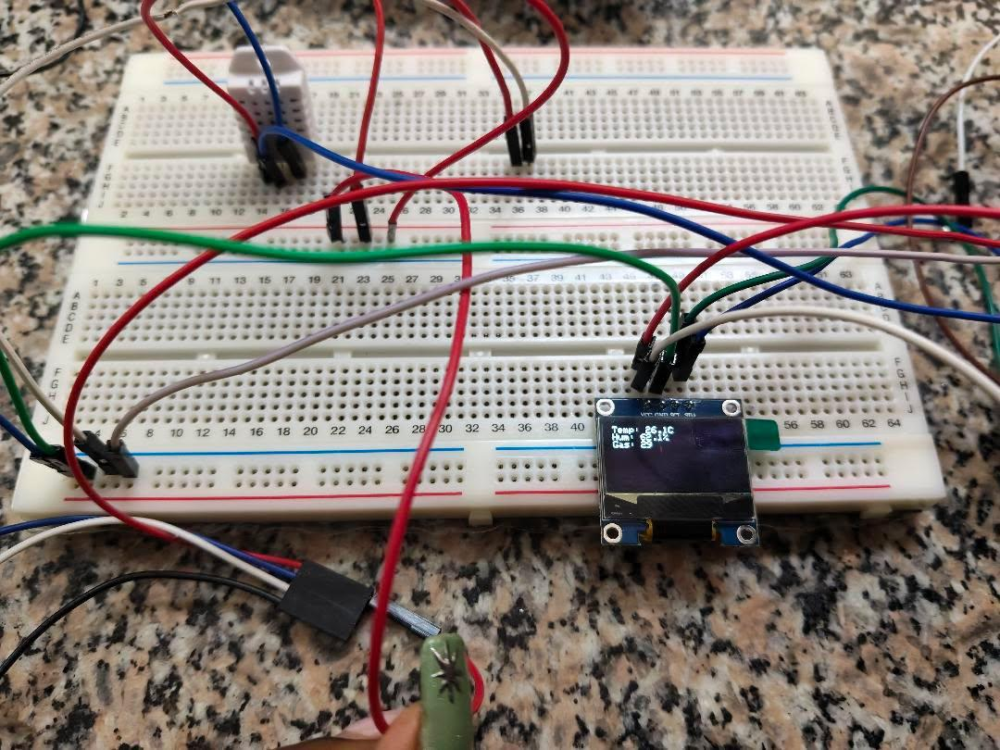
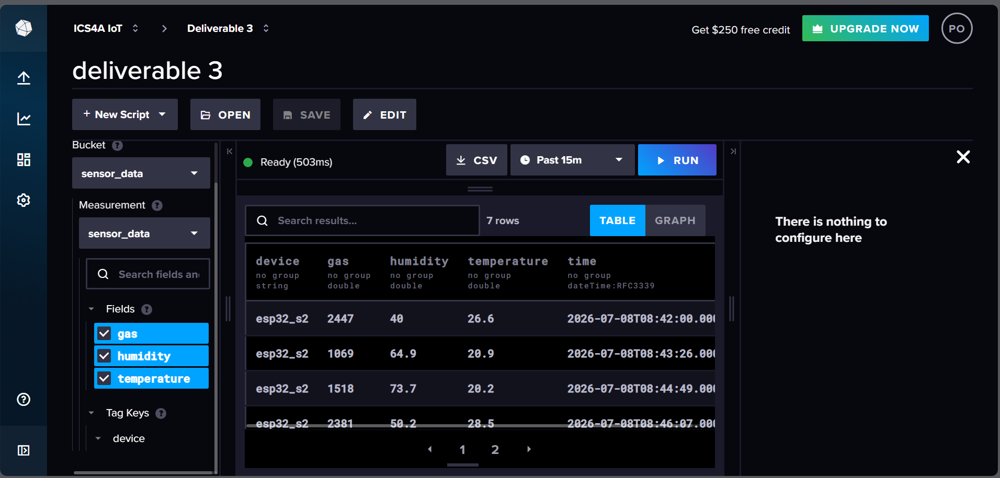
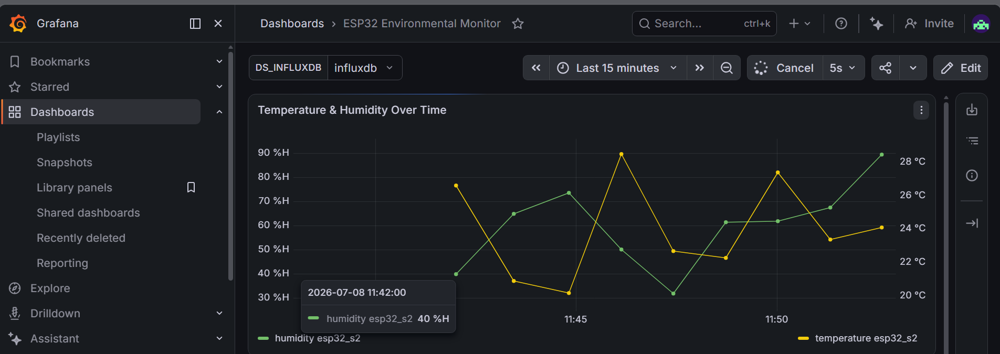

# Motion Masters Project ICS 4A

**Strathmore University**
Bachelor Of Science in Informatics and Computer Science (BICS)
Embedded Systems and Internet of Things (IOT)
ICS 4A

Deliverable 3

Group: Motion Masters


---

## Table of Contents

- [Overview](#overview)
- [System Architecture](#system-architecture)
- [How We Did It Online (VS Code + Wokwi + PlatformIO)](#how-we-did-it-online-vs-code--wokwi--platformio)
- [How We Did It As a Group (Lab Setup)](#how-we-did-it-as-a-group-lab-setup)
- [Cloud Storage and Visualisation](#cloud-storage-and-visualisation)
- [Public Links](#public-links)
- [Known Limitations](#known-limitations)

---

## Overview

Deliverable 3 extends the Motion Masters sensor rig with cloud-based data storage and live visualisation. Sensor readings (temperature, humidity, gas conc) are sampled on an ESP32-S2, batched, and written to **InfluxDB Cloud** — a time-series database — over HTTPS. A **Grafana** dashboard then reads from InfluxDB to display the data through three live visualisations: a time-series graph, a gauge, and a stat panel.


*Figure 1: Data flow from sensors through the ESP32-S2 to InfluxDB Cloud and Grafana.*

---

## System Architecture

```
Sensors (DHT22 + MQ-5) → ESP32-S2 firmware → Batch buffer → InfluxDB Cloud → Grafana dashboard
                                              ↓
                                        OLED display
```

- **DHT22** — temperature and humidity
- **MQ-5** — gas concentration (LPG/natural gas)
- **ESP32-S2** — samples sensors every 2 seconds, shows live values on an OLED, and batches readings for upload
- **InfluxDB Cloud** — stores every reading as a timestamped point in a time-series bucket
- **Grafana** — queries InfluxDB and renders the dashboard

---

## How We Did It Online (VS Code + Wokwi + PlatformIO)

We built and tested the full pipeline in simulation before/alongside physical hardware, using:

- **VS Code** with the **PlatformIO** extension (firmware build system and library management) and the **Wokwi for VS Code** extension (circuit simulator)
- **Wokwi** simulates the ESP32-S2, DHT22, MQ-5, and OLED wiring, and gives the simulated board real internet access via its `Wokwi-GUEST` network — so the simulated device can genuinely reach InfluxDB Cloud over HTTPS
- **PlatformIO** compiles `src/main.cpp` into firmware that Wokwi then runs

### Steps followed:
1. Wired the components in `diagram.json` (ESP32-S2, DHT22, MQ-5, SSD1306 OLED) — see `diagram.json` in this repo.
2. Wrote firmware (`src/main.cpp`) that:
   - Samples the DHT22 and MQ-5 every 2 seconds
   - Displays live readings on the OLED
   - Batches readings and sends them to InfluxDB Cloud in a single HTTPS write every ~10 seconds, using NTP-synced timestamps so each reading lands as a distinct data point
3. Set up an InfluxDB Cloud account, created a bucket (`sensor_data`), and generated an API token.
4. Built a Grafana dashboard (`grafana-dashboard.json`) with three panels reading from that bucket.
5. Ran the simulation in Wokwi and confirmed data appeared in both InfluxDB's Data Explorer and the live Grafana dashboard.


*Figure 2: Wokwi simulation showing live sensor output and successful InfluxDB writes in the terminal.*

Full setup instructions (InfluxDB account setup, PlatformIO build steps, dependencies) are documented in this repo's `README.md`-adjacent setup guide / build notes.

---

## How We Did It As a Group (Lab Setup)


*Figure 3: The team assembling and testing the physical sensor rig in the lab.*


*Figure 4: Physical wiring of the ESP32-S2 with DHT22 and MQ-5.*

As a group, we assembled the physical components (ESP32-S2, DHT22, MQ-5, and OLED display) and wired them according to the same layout used in the Wokwi simulation. We then loaded `main.cpp` and `secrets.h` onto the board using the Arduino IDE, replacing the simulation-only WiFi credentials (`Wokwi-GUEST`) with our real WiFi network credentials, while keeping the same InfluxDB Cloud credentials (organisation, bucket, and API token) used in the online/simulated version. As the sensors captured live readings — visible in real time on the OLED display — the same data was simultaneously transmitted to InfluxDB Cloud and appeared live on the Grafana dashboard, confirming that the physical setup and the simulated setup both fed into the same cloud pipeline correctly.

---

## Cloud Storage and Visualisation

### InfluxDB — Time-Series Storage


*Figure 5: Stored sensor data in InfluxDB's Data Explorer, showing temperature, humidity, and gas readings over time.*

### Grafana — Dashboard (3 Visualisations)

 (images/grafana-dashboard2.png)
*Figure 6: Live Grafana dashboard with time-series, gauge, and stat panels.*

The dashboard includes:
1. **Time Series** — Temperature & Humidity Over Time
2. **Gauge** — Live Gas Level with colour-coded thresholds
3. **Stat Panel** — Latest Readings across all three metrics

---

## Public Links

- **Wokwi Public Project:** [add link here]
- **Grafana Public Dashboard:** [add link here]
- **InfluxDB Data:** see screenshot above (public link not available on current plan)

---

## Known Limitations

- TLS certificate validation is disabled in the firmware (`client.setInsecure()`) for simplicity in the simulated environment; a production deployment would use certificate pinning instead.
- The Grafana dashboard's bucket name is hardcoded to `sensor_data` to match this project's configuration.
- See `src/main.cpp` and the project's build documentation for full technical notes.